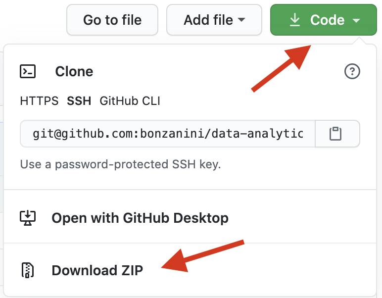

Data Analytics Workshop for Beginners
-----

This repository contains the material for a half-day workshop on data analytics with Python.

This version of the workshop is presented at `EuroPython 2021 <https://ep2021.europython.eu/talks/77AVB6W-data-analysis-with-pandas-workshop/>`_, if you're attending the live session on July 27th, please make sure to get the material and the setup before joining the session.

In this README document:

- Workshop Overview
- Intended Audience
- Installation and Setup
- Running the material

Workshop Overview
-----

The purpose of this workshop is to introduce the audience to some of the Python tools to perform data analysis.

Outline:

- pandas basics (estimated 45 minutes, demo by the trainer)

  - Loading data from CSV files

  - Inspecting the data, summary statistics

  - Data selection and filtering (e.g. boolean indexing, column selection)

  - Data transformation (e.g. ``apply()``, ``map()``)

  - Sorting values

- Exercises on pandas basics (estimated 45 minutes, work on your solutions)

- pandas operations (estimated 45 minutes, demo by the trainer)

  - Data aggregation (``groupby()``)

  - Joining ``DataFrame`` objects (``merge()``)

  - Basics of data visualisation with pandas (``plot()``)

- Exercises on pandas operations (estimated 45 minutes, work on your solutions)

- Outlook on Capstone Project: brief discussion on ideas for personal projects to work on after the workshop

Some tips to get the most out of the workshop:

- please make sure to have a working environment before the session starts
- if you are new to Jupyter notebook, please have a look at the preliminary material first, in particular the notebook ``Using Jupyter notebooks``
- make sure you run all the cells that contain code - cells further down may need the results from an earlier cell!
- if you are confused about what a cell is doing, make sure you read the text above and below it
- we use ``this format`` inside of a block of text to show that this is code that you may end up running yourself later
- there are no silly questions, please do ask for help if you get stuck or if something is unclear

Intended Audience and Preliminaries
-----

This workshop is for people who have some basic knowledge of Python and would like to learn more about, or start a career in, data analytics.

The workshop material includes two notebooks of preliminaries, i.e. one on how to use Jupyter notebooks and one on the basic syntax of Python. They are not part of the workshop, if you are new to Python or Jupyter please go through the preliminaries before the live session to familiarise yourself with some useful concepts.

Installation and Setup
-----

In order to setup the environment and run the workshop material, you'll need to:

- Install Python and relevant libraries on your machine
- Download the workshop material on your machine

Please try to have everything installed before you come to the workshop.

**Install Python and relevant libraries**

We are using Python 3.8, and we will require Jupyter, pandas, and matplotlib
installed. The recommended way to do this is to get the latest Python 3 version of
Anaconda, a Python distribution for data science - this will come with everything installed.

You can download Anaconda Python 3 from https://www.anaconda.com/products/individual (available for Windows, macOS and Linux).

**Download the workshop material**

If you are familiar with ``git``, you can clone the workshop repository using the following command:

::

    git clone https://github.com/bonzanini/data-analytics-workshop.git

Alternatively, you can download a zip file with the content of this repository:

- Click on "Clone or download" (on the top-right of this page, see example in image below)
- Click on "Download ZIP"
- Unzip the file in a folder of your choice

Running the material
-----

The workshop material is distributed as Jupyter notebooks.

In order to run the material, from a terminal firstly navigate to the folder where you have unzipped the files:

::

    cd data-analytics-workshop

then spin up the Jupyter notebook server:

::

    jupyter notebook

At this point the content of this repository should be visible through your browser.

Click on the ``notebooks`` folder, then click on any of the notebooks to run them.

If you are new to Jupyter, the suggestion is to check the preliminary material first,
in particular the notebook titled ``Using Jupyter notebooks``.

License
-----

**Code**

The code in this repository, including all code samples in the notebooks listed above, is released under the
`MIT license`_. Read more at the `Open Source Initiative`_.

.. _MIT license: LICENSE-CODE
.. _Open Source Initiative: https://opensource.org/licenses/MIT

**Text**

The text content of this material, including all narrative in the notebooks listed above, is released under the
`CC-BY-SA license`_. Read more at `Creative Commons`_. 

.. _CC-BY-SA license: LICENSE-TEXT
.. _Creative Commons: https://creativecommons.org/licenses/by-sa/4.0

Credits
-----

The first version of this workshop was born as a joint effort between the `PyData London`_
and `PyLadies London`_ user groups, with volunteer contributions from the organisers.

.. _PyData London: https://www.meetup.com/PyData-London-Meetup/
.. _PyLadies London: https://www.meetup.com/pyladieslondon/

